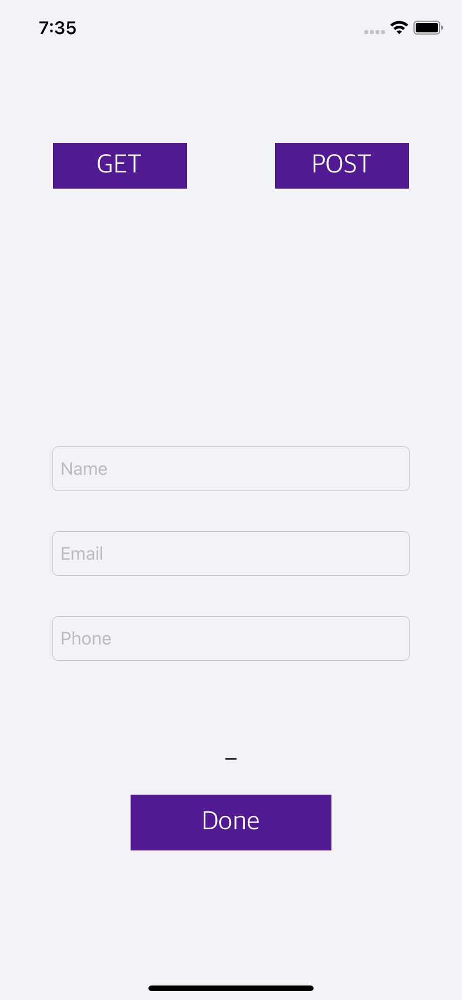
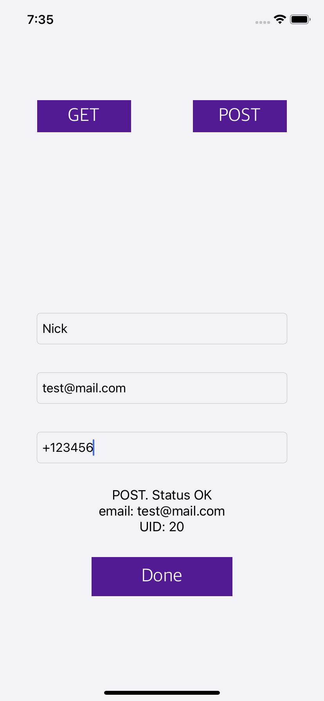

## Project Structure

- *DBTestApp* - main Xcode project.

- *http_server* - scratch in Python responding on HTTP-connection.

- *JSON_Playground* - test files for JSON processing (not used in this project).

---

## Server

- *http_server.py* on run launches HTTP-server on declared IP and Port (based on **Flask**).

- *data.json* stores data obtained from HTTP-request.

## Notes about iOS-app

Before launch you should set IP:Port in variable *host_address* (line 16).
**GET** and **POST** buttons send corresponding sample request to server and print response in Xcode console.
**Send** button sends POST-request with data from textfields and displays server response on the screen.

 
